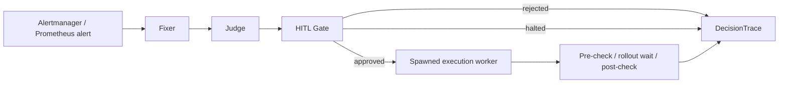

## HERALD Recovery Architecture

### Recovery semantics

- `pending_approval`: HERALD produced a bounded plan and is waiting for human input.
- `rejected`: the operator rejected the proposed action, so HERALD recorded the decision and did not execute.
- `recovered`: the approved action executed and verification confirmed the workload recovered.
- `rolled_back`: the approved action executed, verification failed, and HERALD triggered a bounded rollback that restored recovery.
- `escalated`: HERALD could not safely continue because the Judge halted the plan, execution failed, rollout did not converge, or recovery could not be verified after bounded fallback behavior.

### Crashloop demo artifacts

The crashloop demo helper writes canonical artifacts under `artifacts/crashloop/<timestamp>/`:

- `first-pass.json`: the planning pass that should end at `pending_approval`
- `approval-run.json`: the approved execution pass with the final `DecisionTrace`
- `rejection-run.json`: the rejected execution path when the operator declines the action
- `worker-stream.log`: the live execution-worker stream captured from the approval run
